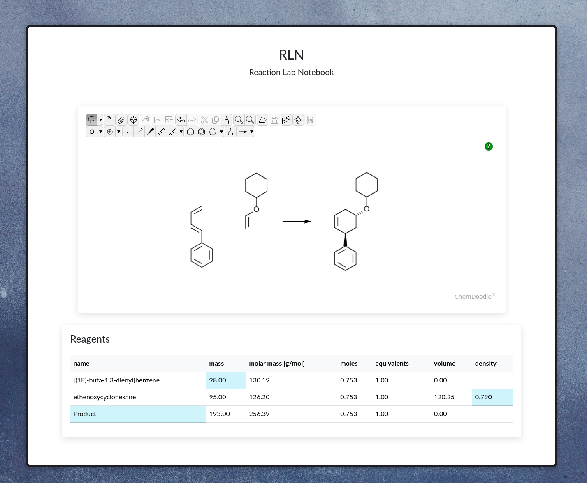

# Reaction Lab Notebook (RLN)

> Warning
>
> **This project is in active development and is a hobby project. It is not a finished product and is subject to change. Use at your own risk.**




## Overview

Reaction Lab Notebook (RLN) is a web-based application designed to help chemists manage and document their chemical reactions. The application provides a sketcher for drawing chemical structures, a table for managing reagents, and functionality to calculate and update reagent properties.

## Features

- Sketch chemical structures using ChemDoodle.
- Manage reagents in a table with editable fields.
- Automatically calculate and update reagent properties based on user input.
- Sync data between the client and server.

## Installation

To set up the project, follow these steps:

1. Clone the repository:
    ```sh
    git clone https://github.com/TheTrebuchet/RLN.git
    cd RLN
    ```

2. Navigate to the app directory:
    ```sh
    cd app
    ```

3. Install the necessary Node.js dependencies:
    ```sh
    npm install
    ```

4. Build and start the Docker containers:
    ```sh
    sudo docker compose up --build
    ```

## Usage

1. Open your web browser and navigate to `http://localhost:3000` to access the RLN application.

2. Use the ChemDoodle sketcher to draw chemical structures.

3. Add and edit reagents in the table. The application will automatically calculate and update reagent properties based on your input.

4. Save your work and sync data with the server as needed.

## Project Structure

- `app`: Contains the main application code.
  - `index.html`: The main HTML file for the application.
  - `script.js`: The main JavaScript file containing the application logic.
  - `style.css`: The main CSS file for styling the application.
- `docker-compose.yml`: Docker Compose configuration file for setting up the development environment.

## Dependencies

- [Node.js](https://nodejs.org/)
- [Docker](https://www.docker.com/)
- [ChemDoodle Web Components](https://web.chemdoodle.com/)
- [Bootstrap](https://getbootstrap.com/)

## Contributing

Contributions are welcome! Please fork the repository and submit a pull request with your changes.

## License

This project is licensed under the MIT License. See the [LICENSE](LICENSE) file for details.

## Acknowledgements

- [ChemDoodle](https://www.chemdoodle.com/) for providing the sketcher component.
- [Bootstrap](https://getbootstrap.com/) for the CSS framework.
- [RDKit](https://www.rdkit.org/) for cheminformatics tools.
